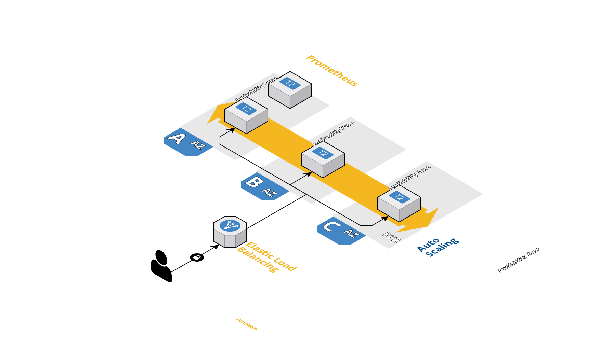

# NodeJS with Terraform and Immutable deployments

## Goal
The goal is to setup a PoC with simple REST API writen in NodeJS that does immutable deployments using Docker and Terraform.
Meaning that for new releases or versions Terraform will re-deploy the infrastructure.

## How it works
### The application
The application (index.js) is a simple REST API written in NodeJS.
THe application will be packaged in a docker container and uploaded to a registry. 

Terraform will create the infrastructure and the base images and also do the deployment
of the application using user_data without user interaction or configuration management.

This scenario is mainly built to be used in a CI/CD environment.

### The infrastructure


Terraform will do all the heavy lifting and configuration:
* Create VPC
* Create Public subnets
* Create Private Subnet and a NAT Gateway
* Create Security Groups
* Create Load Balancer (ELB)
* Create a Auto scaling with two instance in AZ mode with a custom user_data
* Create Prometheus instance for Monitoring


### The deployment
The application is packaged using a docker container. So we can assume that a new docker image exists in the registry.

Terraform is configured using a remote state from Terragrunt. On a new deploy Terraform will create a new Launch Configuration for the autoscaling but use the existing Load Balancer.

This will allow that the new instance will be create from zero and have the application deployed will be added to the existing ELB. If the deployment works correctly Terraform will delete the old Launch Configuration and remove the old instances.


## How to run
This assumes that you have an AWS IAM user with API access and have installed Docker Terraform or Terragrunt.

For a CI environment you can check an example using Travis with the .travis.yml.

For local testing without a CI you can simply run
```bash
cd terraform && make all
```